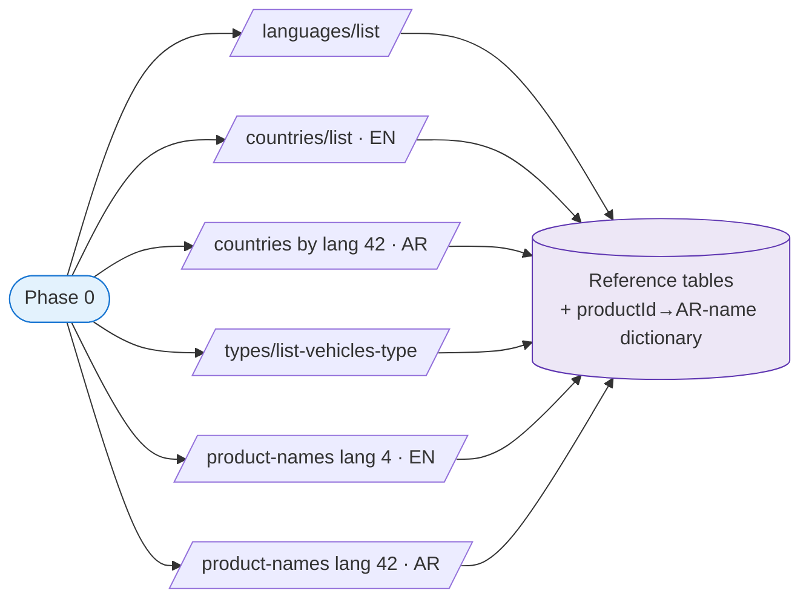
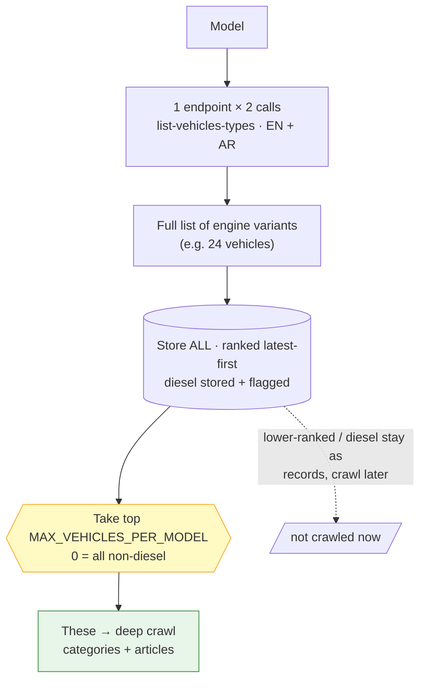
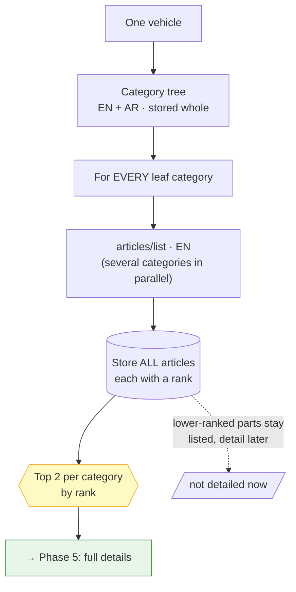
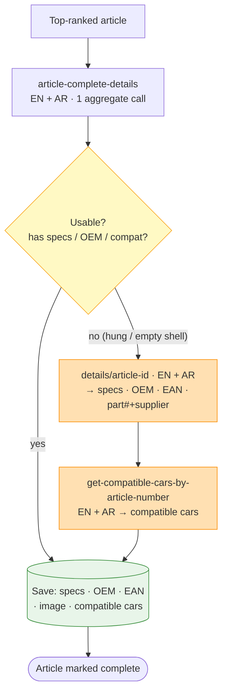
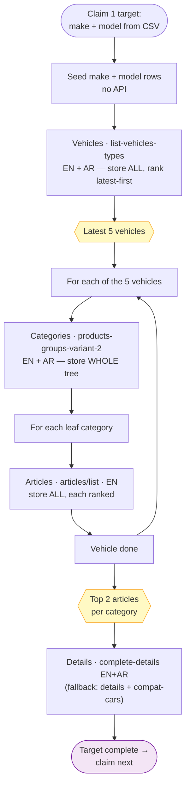
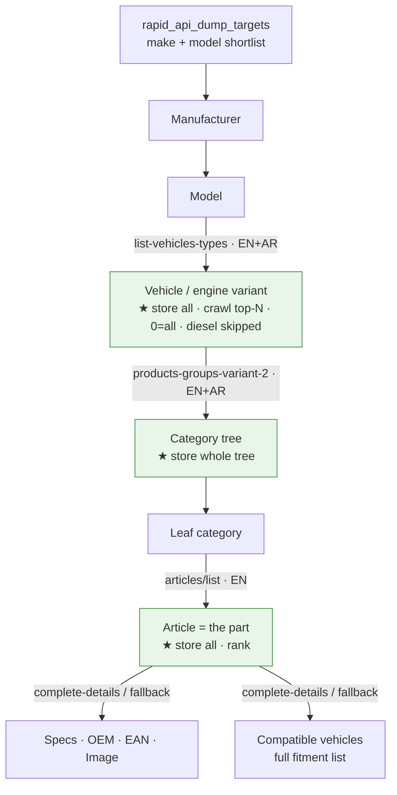

# RapidAPI Auto-Parts Dumper — How the Script Works

> A plain-English walkthrough of what this script does, the order it does it in, and
> every API it calls (with real request + response JSON). No code knowledge needed —
> if you can read JSON and a flowchart, you can follow the whole pipeline.

---

## 1. What this script is (in one breath)

It pulls a **car-parts catalog** out of a third-party API (RapidAPI → *Auto Parts Catalog*,
TecDoc data) and stores it in our own PostgreSQL database.

We don't dump the *whole* world — that would be millions of API calls. Instead we hand
the script a **shortlist of cars we care about** (a CSV of make + model), and for each one
it walks down the tree:

```
Make → Model → Vehicle (engine variant) → Category (part group) → Article (the actual part) → Part details
```

The golden rule of the whole script: **store everything we see, but only spend expensive
API calls deep-crawling the slice we configure** — the top `MAX_VEHICLES_PER_MODEL` engine
variants per model (`0` = all non-diesel, the current setting) and the top
`MAX_ARTICLES_PER_CATEGORY` parts per category. Everything else is saved as a lightweight
record that can be "filled in later" just by raising a limit — no re-crawl needed.

---

## 2. The fixed settings every call uses

Four values are constant for the entire dump. Whenever an API below takes them, these are
the values sent:

| Setting | Value | Meaning |
|---|---|---|
| Vehicle type | `1` | **Passenger Car** (vs. trucks, bikes, etc.) |
| Primary language | `4` | **English (GB)** — the main language we store |
| Arabic language | `42` | **Arabic** — every text endpoint is *also* fetched in Arabic and merged into `_ar` columns |
| Country filter | `80` | **Egypt** — limits models/vehicles to what's sold locally |

**Bilingual rule:** almost every text endpoint is called **twice in parallel** — once in
English, once in Arabic — and the two responses are merged onto the same row. The one
exception is the article list (English only); the Arabic part-name is filled from a
dictionary we fetch once up front (see §4, Phase 0).

**Auth:** every request carries our RapidAPI key in the `x-rapidapi-key` header against
host `auto-parts-catalog.p.rapidapi.com`. The script rotates through multiple keys and
respects the plan limits (≈100 requests/sec, 1,000,000 requests/month).

---

## 3. The big picture (top-level flow)

```mermaid
flowchart TD
    A([Start dump]) --> B[Phase 0: Reference data<br/>languages · countries · vehicle types · product-name dictionary<br/><i>run once</i>]
    B --> C[Read targets from rapid_api_dump_targets<br/>→ the make+model work queue (DB = source of truth)<br/><i>no API calls · imported once from CSV</i>]
    C --> D{Worker pool<br/>8 workers share one rate limit}
    D --> E1[Worker claims<br/>next target]
    D --> E2[Worker claims<br/>next target]
    D --> E3[Worker claims<br/>next target]
    E1 --> F[Deep-crawl ONE make+model<br/>to full depth — see §5]
    E2 --> F
    E3 --> F
    F --> G{More targets<br/>in queue?}
    G -- yes --> D
    G -- no --> H([Job complete])

    style B fill:#e3f2fd,stroke:#1976d2
    style C fill:#fff3e0,stroke:#f57c00
    style F fill:#e8f5e9,stroke:#388e3c
    style H fill:#f3e5f5,stroke:#7b1fa2
```

The work queue is **resumable**: each make+model is `pending → resumable → complete`, and
cursors are written only *after* data is saved. If the job crashes or hits the monthly
quota, the next run picks up exactly where it stopped and never re-charges for finished work.

> **Two traversal modes (`CRAWL_MODE` in `.env`):**
> - **`depth_first`** (default, shown above) — take one manufacturer and crawl it to full
>   depth before the next. Best for getting priority brands *completely* done first.
> - **`breadth_first`** — finish each *level* across ALL targets before going deeper:
>   all manufacturers → all models → all vehicles → all categories → all articles → all
>   details. Best for broad shallow coverage first (every make/model/vehicle on record
>   before spending the expensive detail calls).
>
> Both modes share the same per-entity cursors, so you can pause, switch `CRAWL_MODE`, and
> resume — the next run just continues from the stored state.

---

## 4. Step-by-step — every phase and its APIs

### Phase 0 — Reference data (runs once per job)

Before touching any car, the script loads small lookup tables. These are cheap, fixed calls.

**0a. Languages** — `GET /languages/list`
<details><summary>response</summary>

```json
[
  { "lngId": 4,  "lngIso2": "en", "lngDescription": "English (GB)" },
  { "lngId": 42, "lngIso2": "ar", "lngDescription": "Arabic" }
]
```
</details>

**0b. Countries** (English + Arabic, in parallel)
- `GET /countries/list`
- `GET /countries/list-countries-by-lang-id/42`
<details><summary>response (English)</summary>

```json
{ "countries": [
    { "id": 80, "couCode": "ET", "countryName": "Egypt" },
    { "id": 81, "couCode": "SA", "countryName": "Saudi Arabia" }
] }
```
</details>

**0c. Vehicle types** — `GET /types/list-vehicles-type`
<details><summary>response</summary>

```json
[
  { "id": 1, "vehicleType": "Passenger Car" },
  { "id": 2, "vehicleType": "Commercial Vehicle" }
]
```
</details>

**0d. Product-name dictionary** (English + Arabic, in parallel) — the clever cost-saver.
Every part has a generic "product name" (e.g. *Brake Pad Set*). The Arabic version is the
same for every article of that type, so we fetch the whole dictionary **once** instead of
asking for Arabic on every article list later.
- `GET /category/list-products-names/lang-id/4`
- `GET /category/list-products-names/lang-id/42`
<details><summary>response (one entry shown)</summary>

```json
[
  { "productId": 402, "productName": "Brake Pad Set, disc brake" },
  { "productId": 8,   "productName": "Air Filter" }
]
```
</details>



---

### Phase 1 — The target list: filtering make + model from the CSV

The file [dump_targets.csv](dump_targets.csv) is the hand-picked shortlist of cars to dump.
Each row carries the brand, the model, and — crucially — the TecDoc IDs the API needs.

| Column | Example | Used for |
|---|---|---|
| `status` | `pending` | informational |
| `tec_manufacturer_id` | `111` | **the make ID the API needs** |
| `tec_manufacturer_name` | `TOYOTA` | stored as the brand name |
| `tec_model_id` | `11560` | **the model ID the API needs** |
| `tec_model_name` | `COROLLA Saloon (_E18_)` | stored as the model name |
| `cc_brand_slug`, `cc_model_slug`, … | `toyota`, `corolla` | our own catalog slugs |

The CSV is imported **once** (`dumper.cli import-targets`): the script **keeps only rows
that have both a valid make ID and model ID** (rows missing either are skipped),
de-duplicates repeated make+model pairs, and loads just the make/model ids + names (with
`status='pending'`) into the **`rapid_api_dump_targets`** work-queue. **No API is called
here** — the make and model come straight from the CSV, so we skip the usual "list all
manufacturers / list all models" calls entirely.

After the import, **the table is the source of truth** — the dump never reads the CSV
again; you add/edit/remove targets directly in Postgres. Re-importing an edited CSV only
*adds* new rows; anything already finished keeps its `complete` status (resume-safe).

---

### Phase 2 — Per model: get the vehicles (engine variants) + engine details

Now the worker takes one make+model and asks: *what engine variants exist for this model?*

A **single endpoint** returns the full list of vehicles **with all engine details inline**
(power, fuel, body, cylinders, capacity, engine codes) — so one call fills everything, no
separate engine-spec call. It's called **twice in parallel** (English + Arabic) to capture
the Arabic engine/fuel/body text.

- **English:** `GET /types/type-id/1/list-vehicles-types/{modelId}/lang-id/4/country-filter-id/80`
- **Arabic:** `GET /types/type-id/1/list-vehicles-types/{modelId}/lang-id/42/country-filter-id/80`

<details><summary>response (real, trimmed — one vehicle shown in full)</summary>

```json
{
  "modelType": "PC",
  "countModelTypes": 24,
  "modelTypes": [
    {
      "vehicleId": 52440,
      "manufacturerName": "TOYOTA",
      "modelName": "COROLLA Saloon (_E18_, ZRE1_)",
      "typeEngineName": "1.6 (ZRE181_)",
      "constructionIntervalStart": "2013-06-01",
      "constructionIntervalEnd": "2018-12-01",
      "powerKw": "97.0000",
      "powerPs": "132.0000",
      "fuelType": "Petrol",
      "bodyType": "Saloon",
      "numberOfCylinders": 4,
      "capacityLt": "1.6000",
      "capacityTech": "1598.0000",
      "engineCodes": "1ZR-FAE",
      "engId": 21730
    }
  ]
}
```
</details>

**What the script does with it:**
1. **De-duplicate** by vehicle ID (the source repeats the same vehicle with different
   engine codes).
2. **Store ALL of them** — even if a model has 24 variants, every one is saved. **Diesel
   (and any `VEHICLE_FUEL_EXCLUDE_PREFIXES`) variants are stored too, but flagged
   `is_fuel_excluded` (crawl_rank NULL)** so they're listed in the DB yet skipped from the
   deep crawl. Flip the flag later to deep-crawl one — zero re-fetch.
3. **Rank the non-excluded variants latest-first**: still-in-production engines first, then
   newest end-date, then newest start-date.
4. **Only the top `MAX_VEHICLES_PER_MODEL` non-excluded variants get deep-crawled** in the
   next phases (the rest stay saved as records, crawl later by raising the limit).
   **`MAX_VEHICLES_PER_MODEL=0` means no cap — crawl ALL non-excluded variants** (the
   current setting).

> **Why a cap?** Deep-crawling every engine variant multiplies every downstream call, so
> `MAX_VEHICLES_PER_MODEL` is the single biggest budget lever — set it to the latest N to
> cover the bulk of real-world parts demand, or `0` to crawl every (non-diesel) variant.



*(Best-effort extras fetched around this step, one call each, never blocking the crawl:
brand image `GET /manufacturers/find-by-id/{makeId}`, model metadata + production years
`GET /models/list/type-id/1/manufacturer-id/{makeId}/lang-id/42/country-filter-id/80`,
and model image `GET /models/type-id/1/model-id/{modelId}`.)*

---

### Phase 3 — Per vehicle: get the category tree (all categories)

For each of the **top-ranked non-diesel vehicles** (`MAX_VEHICLES_PER_MODEL`; `0` = all),
the script fetches the full **category tree** — the
nested groups of parts that fit that exact vehicle (Braking System → Disc Brake → Brake Pad,
etc.). Called **twice in parallel** (English + Arabic) and the **entire tree is stored** —
every node, with its English name, Arabic name, and full path.

- **English:** `GET /category/type-id/1/products-groups-variant-2/{vehicleId}/lang-id/4`
- **Arabic:** `GET /category/type-id/1/products-groups-variant-2/{vehicleId}/lang-id/42`

<details><summary>response (real, trimmed — nested tree)</summary>

```json
{
  "categories": {
    "Air Conditioning": {
      "categoryId": 100243,
      "categoryName": "Air Conditioning",
      "level": 1,
      "children": {
        "Compressor/Parts": { "categoryId": 100354, "categoryName": "Compressor/Parts", "level": 2, "children": [] },
        "Condenser":        { "categoryId": 100355, "categoryName": "Condenser",        "level": 2, "children": [] }
      }
    },
    "Braking System": {
      "categoryId": 100006,
      "categoryName": "Braking System",
      "level": 1,
      "children": {
        "Disc Brake": {
          "categoryId": 100626, "categoryName": "Disc Brake", "level": 2,
          "children": {
            "Brake Pad":  { "categoryId": 100030, "categoryName": "Brake Pad Set",  "level": 3, "children": [] },
            "Brake Disc": { "categoryId": 100032, "categoryName": "Brake Disc",     "level": 3, "children": [] }
          }
        }
      }
    }
  }
}
```
</details>

**Leaf categories** (those whose `children` is empty `[]`) are the ones that actually hold
parts — a passenger car returns hundreds of them. The whole tree is saved so we keep the
parent/child structure and the breadcrumb path; the leaves are what Phase 4 iterates over.

---

### Phase 4 — Per leaf category: list the articles (store ALL)

For **every leaf category** of the vehicle, the script pulls the list of articles (actual
parts). Leaf categories are fetched several at a time for speed. This is **English only** —
the Arabic part-name comes from the dictionary loaded back in Phase 0.

- `GET /articles/list/type-id/1/vehicle-id/{vehicleId}/category-id/{categoryId}/lang-id/4`

<details><summary>response (real, trimmed — Air Filter category)</summary>

```json
{
  "vehicleId": 19942,
  "categoryId": 100260,
  "countArticles": 120,
  "articles": [
    {
      "articleId": 5522538,
      "articleNo": "A63193",
      "supplierName": "1A FIRST AUTOMOTIVE",
      "supplierId": 4814,
      "articleProductName": "Air Filter",
      "productId": 8,
      "articleMediaType": "JPEG",
      "articleMediaFileName": "975108278fe2f0e674a0dd0c05fa878ba5be381c.webp",
      "s3image": "https://.../media_files/images/4814/975108278fe2f0e674a0dd0c05fa878ba5be381c.webp"
    }
  ]
}
```
</details>

**What the script does with it:**
- **Stores EVERY article** in the list (even if a category returns hundreds), each tagged
  with its **rank** = its position in the list (rank 1 = first/most-relevant).
- Captures the part's primary image URL, supplier, and product name for free here.
- The same part can appear under many categories/vehicles — it's stored once, but every
  (vehicle, category, article) link is recorded so nothing is lost.

At this point a part is *listed* but not yet *detailed*. Only the **top 2 ranked articles
per category** move on to Phase 5 for full details — the rest stay as listed records.



---

### Phase 5 — Per top article: full details (with a fallback)

For the model's **top 2 articles per category**, the script fetches everything about the
part: technical specifications, OEM cross-reference numbers, EAN barcode, image, and the
**full list of compatible vehicles**. Articles are processed in a sliding window (a few at
a time) so one slow request never stalls the rest.

#### Primary path — one aggregate call (English + Arabic, in parallel)

- `GET /articles/article-complete-details/type-id/1?articleId={id}&langId=4&countryFilterId=80`
- `GET /articles/article-complete-details/type-id/1?articleId={id}&langId=42&countryFilterId=80`

<details><summary>response (representative shape — one call returns it all)</summary>

```json
{
  "article": {
    "articleId": 6828298,
    "articleProductName": "Brake Pad Set, disc brake",
    "s3image": "https://.../images/6372/94042dbb....webp",
    "eanNo": { "eanNumbers": "4047437001234" },
    "allSpecifications": [
      { "criteriaName": "Fitting Position", "criteriaValue": "Front Axle" },
      { "criteriaName": "Height [mm]",       "criteriaValue": "56" },
      { "criteriaName": "Width [mm]",        "criteriaValue": "139" }
    ],
    "oemNo": [
      { "oemBrand": "TOYOTA", "oemDisplayNo": "04465-02220" },
      { "oemBrand": "TOYOTA", "oemDisplayNo": "04465-12610" }
    ],
    "compatibleCars": [
      { "vehicleId": 52440, "modelId": 11560, "manufacturerName": "TOYOTA",
        "modelName": "COROLLA Saloon (_E18_)", "typeEngineName": "1.6",
        "constructionIntervalStart": "2013-06-01", "constructionIntervalEnd": "2018-12-01" }
    ]
  }
}
```
</details>

#### Fallback path — when the aggregate call misbehaves

The aggregate endpoint is **flaky**: sometimes it hangs (times out) or returns an empty
all-null shell even for a valid part. The script retries it once, fast; if it's still
unusable it **composes the same data from two lighter, reliable endpoints** instead:

1. **Part details** (English + Arabic) → specs, OEM, EAN, name, plus the part number +
   supplier ID needed for step 2:
   `GET /articles/details/article-id/{articleId}/lang-id/4`
   <details><summary>response (representative shape)</summary>

   ```json
   {
     "article": { "articleId": 6828298, "articleNo": "EST-50-02-269", "supplierId": 6372 },
     "articleAllSpecifications": [
       { "criteriaName": "Fitting Position", "criteriaValue": "Front Axle" }
     ],
     "articleOemNo": [ { "oemBrand": "TOYOTA", "oemDisplayNo": "04465-02220" } ],
     "articleEanNo": { "eanNumbers": "4047437001234" }
   }
   ```
   </details>

2. **Compatible cars** by part number + supplier (English + Arabic) — because the
   lighter details call carries no fitment list:
   `GET /articles/get-compatible-cars-by-article-number/type-id/1?articleNo={no}&supplierId={sid}&countryFilterId=80&langId=4`
   <details><summary>response (representative shape)</summary>

   ```json
   {
     "articles": [
       { "articleNo": "EST-50-02-269",
         "compatibleCars": [
           { "vehicleId": 52440, "modelId": 11560, "manufacturerName": "TOYOTA",
             "modelName": "COROLLA Saloon (_E18_)", "typeEngineName": "1.6" }
         ] }
     ]
   }
   ```
   </details>

The image is skipped on the fallback path (Phase 4 already saved the primary image).



---

## 5. One full target, end to end

Putting Phases 2–5 together — this is what one worker does for a single make+model before
claiming the next:



---

## 6. The data tree — what feeds what

The catalog is a strict hierarchy. Each level is fetched per parent of the level above it:



### The "store-all, crawl top-N" funnel (the heart of the script)

```
                       SEEN by the API              SAVED              DEEP-CRAWLED
  Vehicles per model     ~24 variants      →    all ~24 stored   →   top MAX_VEHICLES_PER_MODEL (0 = all non-diesel)
  Categories per vehicle  hundreds         →    whole tree       →   all leaves
  Articles per category   hundreds         →    all stored       →   top MAX_ARTICLES_PER_CATEGORY detailed
```

Everything the API shows us is saved. The `MAX_VEHICLES_PER_MODEL` / `MAX_ARTICLES_PER_CATEGORY`
limits only decide where we spend the expensive calls *today* — widening coverage later is a
config change, not a re-crawl.

---

## 7. Where the data lands (storage tree)

Every entity is stored with a UNIQUE natural key and upserted, so re-runs and the same part
seen under many cars never create duplicates.

```
rapid_api_manufacturers            (make)
└─ rapid_api_manufacturer_vehicle_types   (make × Passenger-Car link)
   └─ rapid_api_models             (model)
      └─ rapid_api_vehicles        (engine variants — ALL stored, ranked latest-first)
         └─ rapid_api_vehicle_categories   (vehicle ↔ category links)
            └─ rapid_api_categories        (full category tree, EN + AR, with path)
               └─ rapid_api_category_articles  (vehicle × category × article, with rank)
                  └─ rapid_api_articles        (the parts — ALL stored)
                     ├─ rapid_api_article_specs            (technical criteria, EN + AR)
                     ├─ rapid_api_article_oem_refs         (OEM cross-numbers)
                     ├─ rapid_api_article_compatible_cars  (full fitment list)
                     └─ rapid_api_article_media            (extra images — opt-in)

Reference / dictionary tables:
  rapid_api_languages · rapid_api_countries · rapid_api_vehicle_types · rapid_api_product_names

Control / bookkeeping tables:
  rapid_api_dump_targets   (the CSV work queue: pending → resumable → complete)
  rapid_api_dump_jobs      (job status, phase, live counts, heartbeat)
  rapid_api_api_key_state · rapid_api_monthly_usage   (key rotation + quota tracking)
  rapid_api_unparsed_items (anything the API returned in an unexpected shape, for review)
```

---

## 8. API cheat-sheet (every endpoint, in call order)

| # | Phase | What it gets | Method + Path | Lang calls |
|---|---|---|---|---|
| 0a | Reference | Languages | `GET /languages/list` | 1 |
| 0b | Reference | Countries | `GET /countries/list` · `GET /countries/list-countries-by-lang-id/42` | EN + AR |
| 0c | Reference | Vehicle types | `GET /types/list-vehicles-type` | 1 |
| 0d | Reference | Product-name dictionary | `GET /category/list-products-names/lang-id/4` · `…/42` | EN + AR |
| — | Per make | Brand image | `GET /manufacturers/find-by-id/{makeId}` | 1 |
| — | Per make | Model meta + years | `GET /models/list/type-id/1/manufacturer-id/{makeId}/lang-id/42/country-filter-id/80` | 1 |
| — | Per model | Model image | `GET /models/type-id/1/model-id/{modelId}` | 1 |
| 2 | Per model | **Vehicles + engine details** | `GET /types/type-id/1/list-vehicles-types/{modelId}/lang-id/{4\|42}/country-filter-id/80` | EN + AR |
| 3 | Per vehicle | **Category tree** | `GET /category/type-id/1/products-groups-variant-2/{vehicleId}/lang-id/{4\|42}` | EN + AR |
| 4 | Per leaf cat | **Article list** | `GET /articles/list/type-id/1/vehicle-id/{vehicleId}/category-id/{categoryId}/lang-id/4` | EN |
| 5 | Per top article | **Full details** (primary) | `GET /articles/article-complete-details/type-id/1?articleId={id}&langId={4\|42}&countryFilterId=80` | EN + AR |
| 5↩ | Per top article | Details (fallback) | `GET /articles/details/article-id/{articleId}/lang-id/{4\|42}` | EN + AR |
| 5↩ | Per top article | Compatible cars (fallback) | `GET /articles/get-compatible-cars-by-article-number/type-id/1?articleNo={no}&supplierId={sid}&countryFilterId=80&langId={4\|42}` | EN + AR |

---

## 9. Why it's safe to stop and re-run

- **Work queue:** each make+model moves `pending → resumable → complete`. A status is set
  only after its data is committed, so a crash re-does the unfinished unit — it never skips.
- **Per-row cursors:** "vehicles fetched", "categories fetched", "articles fetched",
  "details fetched" timestamps mean a resumed run does only what's still missing.
- **Idempotent saves:** every table upserts on a natural key, so seeing the same part under
  many cars (very common) costs zero duplicate rows.
- **Quota-aware:** if the keys hit the per-second or monthly limit, the job **pauses**
  cleanly (not fails) and the next run continues from the exact stopping point.
- **Graceful stop:** a stop request lets each worker finish its current small unit, commit,
  and exit — so you can pause mid-dump without corrupting anything.
```
